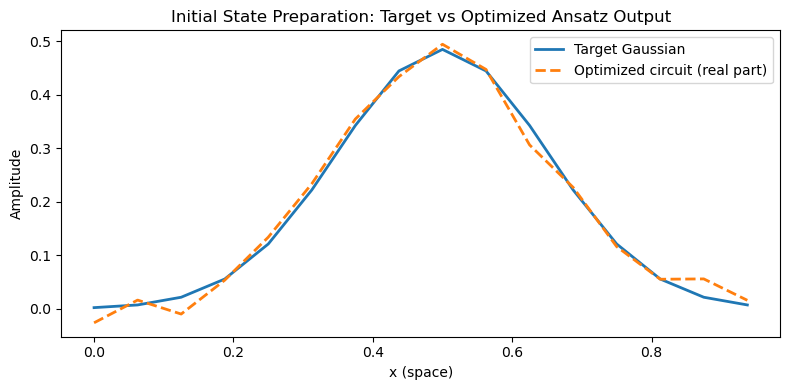

#  Method Description \& Validation

## Method Description

The pipeline implements a variational quantum algorithm for integrating 2D partial differential equations (PDEs) with periodic boundary conditions, following the approach of [Lubasch et al. (2019)](https://arxiv.org/pdf/1907.09032). The main steps are as follows:

### 1. Variational Ansatz Selection

A hardware-efficient ansatz is used, constructed from parameterized single-qubit rotations and entangling gates. For a 2D grid of size $N \times N$, $n = 2 \log_2 N$ qubits are used. The ansatz is defined in `src/ansatz.py`:

```python
n_qubits = 4
depth = 2
ansatz = HEAnsatz(n_qubits, depth)
print(ansatz.qc(ansatz.random_params()).draw())
```
```
############# output
     ┌────────────┐     ┌────────────┐                                       
q_0: ─┤ Ry(1.0278) ├──■──┤ Ry(0.1539) ├─────────────────────■─────────────────
     ┌┴────────────┤┌─┴─┐└────────────┘┌────────────┐     ┌─┴─┐               
q_1: ┤ Ry(-2.9792) ├┤ X ├──────■───────┤ Ry(-2.944) ├─────┤ X ├───────■───────
     └┬────────────┤└───┘    ┌─┴─┐     └────────────┘┌────┴───┴────┐┌─┴─┐     
q_2: ─┤ Ry(2.2895) ├─────────┤ X ├───────────■───────┤ Ry(-1.2606) ├┤ X ├──■──
     ┌┴────────────┤         └───┘         ┌─┴─┐     ├─────────────┤└───┘┌─┴─┐
q_3: ┤ Ry(0.70717) ├───────────────────────┤ X ├─────┤ Ry(-1.6176) ├─────┤ X ├
     └─────────────┘                       └───┘     └─────────────┘     └───┘
```


### 2. Initial State Preparation

The initial state is a normalized 2D Gaussian:
$$
f(x, y) \propto \exp\left(-\frac{(x-0.5)^2 + (y-0.5)^2}{2\sigma^2}\right)
$$
with $\sigma=0.15$, encoded as a quantum state using the variational ansatz.

The ansatz parameters are optimized by minimizing the negative fidelity (equivalent to maximizing the fidelity) with the target Gaussian state:

```python
target = gaussian_state(n_qubits, domain=domain, sigma=sigma)
lambdas, init_fidelity = prepare_initial_state(
    n_qubits=n_qubits,
    depth=depth,
    domain=domain,
    sigma=sigma,
)
```



See [`examples/initial_state_prep.ipynb`](https://github.com/DanieleCucurachi/quantum-pde-solver/blob/main/examples/initial_state_prep.ipynb) for more details.

### 3. Cost Function Construction

At each time step, the cost function is constructed as:

$$C(\lambda_0, \lambda) = |\lambda_0|^2 - 2 \, \mathrm{Re}\{\lambda_0 \tilde{\lambda}_0^* \langle 0| \tilde{U}^\dagger (1 + \tau \hat{O}) U(\lambda) |0\rangle\} + \text{const}$$

where $\hat{O}$ is the operator corresponding to the PDE (e.g., Laplacian for diffusion). The cost function is evaluated using quantum circuits that implement the required overlaps and operator expectation values, see [`src/pdes.py`](https://github.com/DanieleCucurachi/quantum-pde-solver/blob/main/src/pdes.py) for more details.

### 4. Time Evolution (Forward Euler)

The solution is propagated in time using a forward Euler scheme. At each step, the cost function is minimized with respect to the variational parameters and scaling factor $\lambda_0$, updating the quantum state to approximate the solution at the next time step. This is implemented in [`src/time_evo.py`](https://github.com/DanieleCucurachi/quantum-pde-solver/blob/main/src/time_evo.py):

```python
for step in range(nsteps):
    params, cost_val = optimize_step(
        pde=pde,
        init_params=params
    )
    pde.update_state(params[0], params[1:])  # NOTE: this is nedeed for computing \tilde{U} in the next step
```

### 5. Validation and Consistency Checks (!WORK IN PROGRESS!)


##### **Norm Conservation**


##### **Cost Function Monitoring**


##### **Visualization & Physical Consistency Checks**
Snapshots of $$f(x, y, t)$$ are generated at selected time points using the visualization tools in `src/plot.py`.  

```python
df_funcs = time_evolution_dataframe_2d(df, n_qubits, depth, domain)
plot_time_evolution_2d(df_funcs, max_plots=6, outfile=None)
```

Validation includes verifying that the dynamics obey known physical symmetries and qualitative behavior:  
- **Symmetry preservation:** For symmetric initial conditions, isotropy should be maintained (e.g., behavior along $$x$$ and $$y$$ should remain equivalent).  
- **Expected physical trends:** For diffusion-like processes, $$f(x,y,t)$$ should exhibit progressive smoothing over time; for Hamiltonian evolution, total energy should be conserved.  
- **Parameter dependence:** Convergence and accuracy should improve with smaller time-step $$\tau$$ and increased ansatz depth or circuit expressivity.

##### **Validation Against Classical Solvers**

Where feasible, quantum results are validated against classical finite-difference or spectral solvers using identical grids and boundary conditions.  
- **Quantitative metrics:** Compute standard error measures such as  
  - Mean Absolute Error (MAE), 
  - $$L^2$$ norms between the quantum and classical solutions.  

This comparison provides a ground truth for small or moderate system sizes.


##### **Standard Sanity Checks**

- **Expected behavior:** Verify that results converge smoothly as grid resolution / ansatz complexity increases or $\tau$ (time step) decreases.  
- **Stability:** Small perturbations in initialization or hyperparameters should not drastically alter the outcome. 
- **Statistical consistency:** Repeated runs with random seeds should yield statistically stable averages within uncertainty bounds.


### 6. Implementation Details

- Quantum circuits are constructed through the functions defined in [`src/circuit.py`](https://github.com/DanieleCucurachi/quantum-pde-solver/blob/main/src/circuit.py) and simulated using Qiskit and Qiskit Aer.

- The pipeline is modular, supporting both 1D and 2D PDEs, and both diffusion and Burgers’ equations. New PDEs can be easily added by simply defining their cost function, as done per diffusion and Burgers in [`src/pdes.py`](https://github.com/DanieleCucurachi/quantum-pde-solver/blob/main/src/pdes.py).

- All parameters (grid size, time step, diffusion coefficient, etc.) are configurable at the script level.